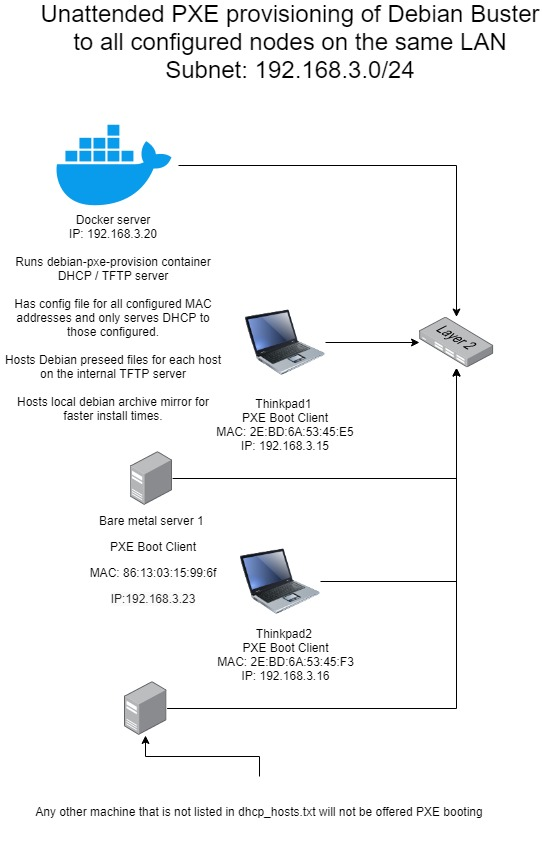

# debian-pxe-provision

Unattended bare metal provisioner via PXE boot and Debian netboot preseed. This
will boot systems, over the network, with either UEFI or legacy BIOS, and
automatically install debian on them according to your own preseed files.

This runs `dnsmasq` as a DHCP and tftp boot server. It binds to a real host
interface (specified by `INTERFACE`) connected to the same LAN as your client
machines. It only serves DHCP to the clients that you explicitly list in
`dhcp_hosts.txt`. 

There is optional support for hosting a
[lazy-distro-mirror](https://github.com/EnigmaCurry/lazy-distro-mirrors) so that
you can cache the portions of the debian mirror you are downloading, for
speeding up subsequent installs. You can also set `DEBIAN_MIRROR` to your own
mirror location if you already have one.

This container is intended to be short-lived, and only running when you actually
want to be doing installations. Treat this a bit like a loaded gun, with a few
safety mechanisms.





## Environment variables

These environment variables can be set for the container. The ones without a
default must be set, or the container will complain.

| Environment Variable | Default                             | Description                                                     |
|----------------------|-------------------------------------|-----------------------------------------------------------------|
| INTERFACE            |                                     | The host network interface to bind to. (eg. eth0, eno1)         |
| CLIENT_INTERFACE     | eno1                                | The name of the client network interface to configure.          |
| DHCP_HOSTS           | /data/dhcp_hosts.txt                | The path to the dnsmasq hosts file inside the container         |
| DEBIAN_MIRROR        | http://debian.csail.mit.edu/debian/ | The upstream debian mirror for clients to use                   |
| LAZY_MIRROR          | false                               | Whether to turn on the local lazy-mirror of the upstream mirror |

## Running

The container must be run privileged and attached to the host network.
(`--privileged --network host`)

You must mount a volume containing the following:
 * A list of your dhcp host configurations. `/data/dhcp_hosts.txt`
 * One line per host comma seperated: `2E-BD-6A-53-45-E5,thinkpad1,192.168.2.15,24h` 
   * MAC address (use hyphens `-` as the seperator)
   * hostname
   * ip address
   * DHCP lease time
 * A directory containing debian preseed configurations for each host (per MAC
   address). `/data/preseed/[MAC ADDRESS].cfg`

The [data](data) directory included is an example configuration that you can use
to base your own configuration. To run the default configuration:

```
docker run \
  --privileged \
  --network host \
  -v $(pwd)/data:/data \
  -e INTERFACE=eth0 \
  plenuspyramis/debian-pxe-provision
```

## Example

 * You have a docker server with an ip address of `192.168.3.20`.
 * The DHCP server will serve the same subnet as configured for the interface,
   in this case it's `192.168.3.0/24`.
 * The server has a primary ethernet device called `eth0`. 
 * You have a client called `thinkpad1` with a MAC address of
   `2E-BD-6A-53-45-E5` that you want to give the ip address `192.168.3.15`.
 * You have a client called `thinkpad2` with a MAC address of
   `2E-BD-6A-53-45-F3` that you want to give the ip address `192.168.3.16`.
 * Clients have interace called `eth1` (You must check what the interface is
   actually called in the debian-installer, it can sometimes be backwards from
   other environments. Experiment with `eth1`, `eth0`, `eno1` etc.)

On the server, create a `dhcp_hosts.txt` file:

```
mkdir -p /etc/containers/debian-pxe-provision
mkdir -p /etc/containers/debian-pxe-provision/preseed

cat <<EOF > /etc/containers/debian-pxe-provision/dhcp_hosts.txt
2E-BD-6A-53-45-E5,thinkpad1,192.168.3.15,24h
2E-BD-6A-53-45-F3,thinkpad2,192.168.3.16,24h
EOF
```

Put preseed files into the directory
`/etc/containers/debian-pxe-provision/preseed`. Name them like
`D6-7D-FE-91-C8-F2.cfg` based on the MAC address of each client.

Then run the container:

```
docker run --rm -it \
  --privileged \
  --network host \
  -v /etc/containers/debian-pxe-provision:/data \
  -e INTERFACE=eth0 \
  -e CLIENT_INTERFACE=eth1 \
  plenuspyramis/debian-pxe-provision
```

Check the output of the container and the generated config output: 

```
### Computed dnsmasq.conf:
     1  ## The host interface name to bind to:
     2  interface=eth0
     3  bind-interfaces
     4
     5  # Turn off dns server:
     6  port=0
     7
     8  ## Only serve static leases to specific MAC addresses:
     9  dhcp-range=192.168.3.0,static
    10  ## Boot UEFI:
    11  dhcp-boot=debian-installer/amd64/bootnetx64.efi,pxeserver,192.168.3.20
    12  ## Specify gateway
    13  dhcp-option=3,192.168.3.1
    14  ## Specify DNS servers
    15  dhcp-option=6,1.0.0.1,1.1.1.1
    16
    17  # Legacy BIOS (non-UEFI) should boot pxelinux instead:
    18  pxe-service=X86PC, "Boot BIOS PXE", pxelinux.0
    19
    20  dhcp-no-override
    21  log-dhcp
    22
    23  pxe-prompt="Booting PXE Client in 5 seconds...", 5
    24
    25  enable-tftp
    26  tftp-root=/tftp/
    27
    28  no-daemon
    29

### Allowed DHCP hosts:
     1  2E-BD-6A-53-45-E5,thinkpad1,192.168.3.15,24h
     2  2E-BD-6A-53-45-F3,thinkpad2,192.168.3.16,24h

dnsmasq: started, version 2.80 DNS disabled
dnsmasq: compile time options: IPv6 GNU-getopt no-DBus no-i18n no-IDN DHCP DHCPv6 no-Lua TFTP no-conntrack ipset auth no-DNSSEC loop-detect inotify dumpfile
dnsmasq-dhcp: DHCP, static leases only on 192.168.3.0, lease time 1h
dnsmasq-dhcp: DHCP, sockets bound exclusively to interface eth0
dnsmasq-tftp: TFTP root is /tftp/
```

Boot your clients and they should go directly into the debian installer over the network.

## Lazy mirror

If you are provisioning more than a handful of machines, you will want to host
your own local mirror. You can create a full mirror with a tool like
[aptly](https://www.aptly.info/) - the main debian archive mirror is around
64GB. Alternatively, you can run a
[lazy-distro-mirror](https://github.com/EnigmaCurry/lazy-distro-mirrors) which
is a caching proxy server for only the bits you actually need.

Here's the idea:

 * You set `DEBIAN_MIRROR` normally. Choose a fast mirror from [the offical
   debian mirror list](https://www.debian.org/mirror/list). **Your nodes will
   always use this URL, both during install, and after install.**
 * The trick is that `debian-pxe-provision` is a DNS server that tells PXE
   booted clients to use a different IP address for the `DEBIAN_MIRROR`. It
   overrides the DNS for whatever domain your chosen `DEBIAN_MIRROR` has, such
   that **during install DEBIAN_MIRROR will actually resolve to the the lazy
   mirror IP address**. This will save you bandwidth as your nodes will retrieve
   packages from the local lazy mirror, but they will still think they are
   getting it from the real mirror because they are using the same URL always.
 * Once the nodes reboot, they will be using their regular DNS server, with no
   spoofed entries. So from then on, those nodes will use the real
   `DEBIAN_MIRROR`.
 * This way the lazy mirror doesn't need to stay running indefinitely, it only
   needs to run when you are doing installs.
   
   
Configuire a lazy mirror on the same docker server running
`debian-pxe-provision`:

```
mkdir -p /etc/containers/lazy-distro-mirrors
cat <<EOF > /etc/containers/lazy-distro-mirrors/config.yaml
mirrors:
  debian.csail.mit.edu: http://debian.csail.mit.edu 
EOF
```

Make sure that the mirror you configure is the same one as
`debian-pxe-provision` environment `DEBIAN_MIRROR` variable.

Now start the lazy mirror:

```
docker run \
  --name lazy-distro-mirrors \
  -d --restart=always \
  --publish 80:8080 \
  --volume /etc/containers/lazy-distro-mirrors:/docker_configurator/user \
  --volume lazy-distro-mirrors:/var/spool/squid \
enigmacurry/lazy-distro-mirrors
```

## Development loop

If you are me, or you are developing with docker-machine, here is a dev loop
that does all the following:

 * Copies the `data` directory from local workstation to the server. (Creating
   paths if not existing.)
 * Builds the docker image.
 * Runs the container on the server

This assumes you have docker installed on your workstation and you are using a
remote docker server with an ssh config called `docker1`, [as outlined in the
parent
README.](https://github.com/PlenusPyramis/dockerfiles#mini-docker-development-tutorial)


```
ssh docker1 "mkdir -p /etc/containers" && \
   rsync -avz --delete data/ docker1:/etc/containers/debian-pxe-provision && \
   docker build -t plenuspyramis/debian-pxe-provision . && \
   docker run --rm -it \
     --privileged \
     --network host \
     -v /etc/containers/debian-pxe-provision:/data \
     -e INTERFACE=eth0  \
     -e DHCP_HOSTS=/data/dev_hosts.txt \
     plenuspyramis/debian-pxe-provision
```
